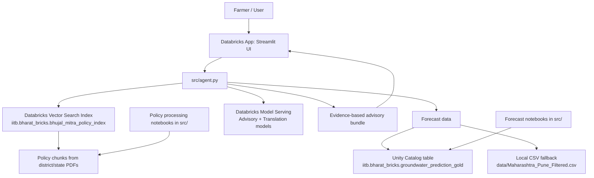

# Bhujal Mitra (Swatantra Track)

**Live App:** https://bhujal-mitra-app-7474648490486213.aws.databricksapps.com/

(Does not work if not in common workspace)

Bhujal Mitra is a district-level groundwater advisory app for farmers in Maharashtra. It uses policy documents and forecast data to give practical, step-by-step farm actions in English, Hindi, and Marathi.

## Project write-up (<=500 chars)
Bhujal Mitra gives district-specific groundwater advice for farmers in Maharashtra. It combines policy document retrieval with groundwater and rainfall forecast context, then returns simple actions for the next 24 hours, 7 days, and 30 days. We built this to turn scattered policy and forecast data into clear farm decisions with evidence from sources and forecast values.

## Architecture diagram


## How it works (End-to-End Flow)

### 1. Data Prep & Filtering
We start with a national groundwater dataset but narrow it down to a reliable geographic patch (like the Pune region) to avoid sparse or noisy data. We filter out incomplete records, check station history depth, and create a clean, regional dataset that the model can actually learn from.

### 2. Time-Series Forecasting
Using our clean data, we build daily features like groundwater and rainfall lags, rolling averages, and seasonal cycles. We use a residual modeling approach—predicting the change from the previous day rather than the raw level—and test it using time-aware backtesting. To generate the final numbers, we predict 30 days ahead step-by-step, feeding each day's prediction back into the features for the next day.

### 3. Policy Processing & Vector Search
We extract text from Maharashtra and district-specific agricultural policy PDFs, chop them into 500-word chunks (with a 50-word overlap so we don't drop context), and save them to a Delta table. Databricks Vector Search indexes these chunks so the app can quickly find the exact right policy text.

### 4. Advisory Engine
When a farmer asks a question, the backend grabs the relevant policy chunks from Vector Search and the 30-day forecast numbers from our data tables. It bundles all this evidence together and hands it to the LLM, which writes out clear, step-by-step advice.

### 5. Frontend & Translation
The user interacts with a Streamlit interface. They pick their district, type a question, and get an answer backed by real data and policy. If they click the Hindi or Marathi buttons, our chosen translation models convert the advice on the fly.

## What is in this repo
- `app.py`: Streamlit app (district, language, query input, advisory output, context panel).
- `src/agent.py`: retrieval + prompt + model calls + translation flow.
- `data/policies/`: district and Maharashtra policy PDFs.
- `data/Maharashtra_Pune_Filtered.csv`: forecast fallback data.
- `app.yml`: Databricks App command and env config.
- `src/*.ipynb`: policy processing, vector index setup, and forecast notebooks.

## Databricks technologies used
- Databricks Apps (Streamlit UI deployment)
- Databricks Vector Search (policy chunk retrieval)
- Databricks Model Serving (LLM inference for advisory and translation)
- Delta/Lakehouse tables in Unity Catalog (forecast + policy indexing pipeline)
- Apache Spark / PySpark (data processing and notebook workflows)
- Databricks CLI (sync and deploy)

## Open-source models used in this project
### Advisory generation (English)
- `databricks-meta-llama-3-1-8b-instruct` (primary)
- `databricks-gemma-3-12b` (fallback)

### Translation
- Hindi: `Param-1 (2.9B)`
- Marathi: `Param-1 (2.9B)`
- Quality fallback (only when needed): `databricks-qwen3-next-80b-a3b-instruct`

## How to run locally (exact commands)
```bash
cd /home/mridul-sharma/Desktop/bhujal-mitra
python3 -m venv .venv-1
source .venv-1/bin/activate
pip install -r requirements.txt
/home/mridul-sharma/Desktop/bhujal-mitra/.venv-1/bin/python -m streamlit run app.py --server.port 8501 --server.address 0.0.0.0
```

Open: `http://127.0.0.1:8501`

## How to deploy on Databricks Apps (exact commands)

### 1) Create app once
```bash
databricks apps create bhujal-mitra-app --description "Bhujal Mitra Streamlit advisory app" --compute-size MEDIUM --profile DEFAULT -o json
```

### 2) Build a minimal deploy bundle (avoids large-file upload limits)
```bash
cd /home/mridul-sharma/Desktop/bhujal-mitra
rm -rf .deploy_bundle
mkdir -p .deploy_bundle/src .deploy_bundle/data/policies
cp app.py app.yml requirements.txt .deploy_bundle/
cp src/__init__.py src/agent.py .deploy_bundle/src/
cp data/Maharashtra_Pune_Filtered.csv .deploy_bundle/data/
find data/policies -maxdepth 1 -type f -name '*.pdf' -size -10M -exec cp {} .deploy_bundle/data/policies/ \;
```

### 3) Sync and deploy
```bash
databricks sync .deploy_bundle /Workspace/Users/23b0353@iitb.ac.in/bhujal-mitra-app-src-lite --profile DEFAULT --full
databricks apps deploy bhujal-mitra-app --source-code-path /Workspace/Users/23b0353@iitb.ac.in/bhujal-mitra-app-src-lite --profile DEFAULT -o json
databricks apps get bhujal-mitra-app --profile DEFAULT -o json
```

## Demo steps (click flow + prompt)
1. Open the app link provided above.
2. In `District`, choose `Ahmednagar`.
3. In `Response language`, choose `English`.
4. In `Your agricultural question`, run:
   - `my crops are drying, what to do?`
5. Click `Get Advice`.
6. Check that the answer includes:
   - District Situation
   - Policy Evidence
   - Forecast Evidence
   - 24-hour / 7-day / 30-day actions
7. Click language buttons (`Hindi`, `Marathi`) to view translated output.
8. In `Context Snapshot`, verify:
   - policy sources listed
   - forecast rows returned
   - forecast columns shown